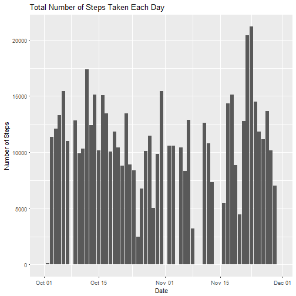
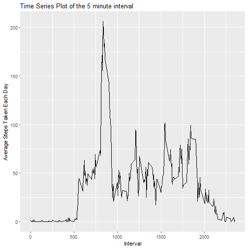
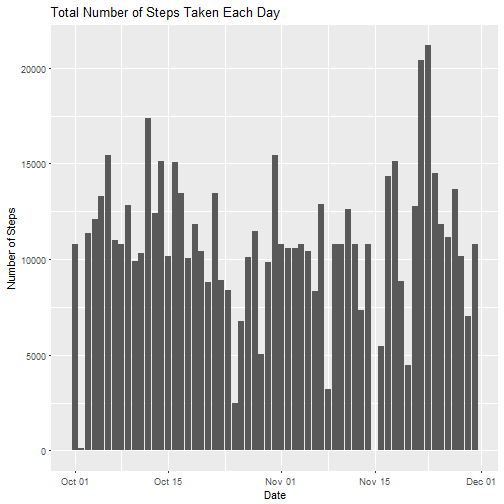
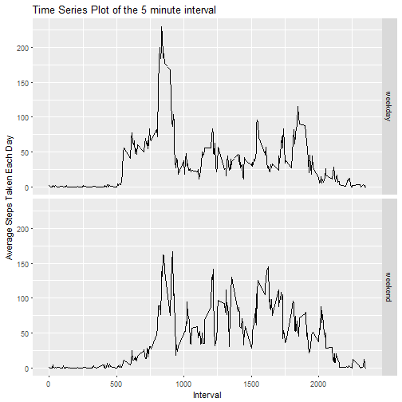

#PA1_template.Rmd

This is the markdown file for Peer Graded Project 1 of Reproducible Research :)

###The various steps to be performed on the data are -
1 Code for reading in the dataset and/or processing the data  
2 Histogram of the total number of steps taken each day  
3 Mean and median number of steps taken each day  
4 Time series plot of the average number of steps taken  
5 The 5-minute interval that, on average, contains the maximum number of steps 
6 Code to describe and show a strategy for imputing missing data  
7 Histogram of the total number of steps taken each day after missing values are imputed  
8 Panel plot comparing the average number of steps taken per 5-minute interval across weekdays and weekends  
9 All of the R code needed to reproduce the results (numbers, plots, etc.) in the report  

 
###The variables included in this dataset are:

1 **steps**: Number of steps taking in a 5-minute interval (missing values are coded as NA)  
2 **date**: The date on which the measurement was taken in YYYY-MM-DD format  
3 **interval**: Identifier for the 5-minute interval in which measurement was taken  


I am going to start my analysis now :) 

#1 Code for reading in the dataset and/or processing the data  


```r
activityDataRaw <- read.csv("./activity.csv",stringsAsFactors = FALSE)
print(head(activityDataRaw))
```

```
##   steps       date interval
## 1    NA 2012-10-01        0
## 2    NA 2012-10-01        5
## 3    NA 2012-10-01       10
## 4    NA 2012-10-01       15
## 5    NA 2012-10-01       20
## 6    NA 2012-10-01       25
```


As we can see there are a lot of NA values in the steps column !

PROCESSING

STEP 1 : Converting the date column from character to Date class.

```r
activityData <- mutate(activityDataRaw , date=as.Date(date))
str(activityData)
```

```
## 'data.frame':	17568 obs. of  3 variables:
##  $ steps   : int  NA NA NA NA NA NA NA NA NA NA ...
##  $ date    : Date, format: "2012-10-01" "2012-10-01" ...
##  $ interval: int  0 5 10 15 20 25 30 35 40 45 ...
```


#2 Histogram of the total number of steps taken each day  

We need to calculate the number of steps.


```r
stepsEachDay <- group_by(activityData,date) %>% summarize(total_steps=sum(steps,na.rm=TRUE))

str(stepsEachDay)
```

```
## Classes 'tbl_df', 'tbl' and 'data.frame':	61 obs. of  2 variables:
##  $ date       : Date, format: "2012-10-01" "2012-10-02" ...
##  $ total_steps: int  0 126 11352 12116 13294 15420 11015 0 12811 9900 ...
```

Now plotting the histogram for this table 


```r
plotObject1 <- ggplot(stepsEachDay,aes(date,weight=total_steps)) + geom_histogram(stat="count") + labs(x="Date",y="Number of Steps",title="Total Number of Steps Taken Each Day ")
```

```
## Warning: Ignoring unknown parameters: binwidth, bins, pad
```

```r
print(plotObject1)
```



#3 Mean and median number of steps taken each day 

Calculating the mean of each day using tapply where the data is split by the column date.


```r
meanOfStepsEachDay <- tapply(activityData$steps,INDEX = activityData$date,FUN=mean,na.rm=TRUE)

medianOfStepsEachDay <- tapply(activityData$steps,INDEX = activityData$date,FUN=median,na.rm=TRUE)
```
#####MEAN

```r
head(meanOfStepsEachDay)
```

```
## 2012-10-01 2012-10-02 2012-10-03 2012-10-04 2012-10-05 2012-10-06 
##        NaN    0.43750   39.41667   42.06944   46.15972   53.54167
```
#####MEDIAN

```r
head(medianOfStepsEachDay)
```

```
## 2012-10-01 2012-10-02 2012-10-03 2012-10-04 2012-10-05 2012-10-06 
##         NA          0          0          0          0          0
```

#4 Time series plot of the average number of steps taken 

Calculating the time series data i.e. 5 minute interval data averaged over all the days 

```r
timeSeriesData <- group_by(activityData,interval) %>% summarize(average_steps=mean(steps,na.rm=TRUE))
head(timeSeriesData)
```

```
## # A tibble: 6 × 2
##   interval average_steps
##      <int>         <dbl>
## 1        0     1.7169811
## 2        5     0.3396226
## 3       10     0.1320755
## 4       15     0.1509434
## 5       20     0.0754717
## 6       25     2.0943396
```

Plotting the Time Series Plot for the 5 minute Interval 


```r
timeSeriesPlot <-  ggplot(timeSeriesData,mapping=aes(interval,average_steps)) +geom_line() + labs(x="Interval",y="Average Steps Taken Each Day",title="Time Series Plot of the 5 minute interval")
print(timeSeriesPlot)
```



#5 The 5-minute interval that, on average, contains the maximum number of steps  

Finding the interval which has the maximum number of Steps


```r
indexOfMaxAverageStep <- which.max(x = timeSeriesData$average_steps)
timeSeriesData$interval[indexOfMaxAverageStep]
```

```
## [1] 835
```


#6 Code to describe and show a strategy for imputing missing data  
Creating a function that will check if a value in the steps column of the activity data is NA.
If it is NA then it'll replace the NA value with the step value from that same interval from the timeSeriesData( made in step 4)


```r
imputingValues <- function(x,data){
        
        for(i in 1:length(x$steps)){
                singleRowX <- x[i,]
                
                if(is.na(singleRowX$steps)){
                        intervalNumber <- singleRowX$interval
                        x[i,1] <-round( timeSeriesData$average_steps[timeSeriesData$interval==intervalNumber])
                }
                
        }
        
        return(x)
}

imputedActivityData <- imputingValues(activityData,timeSeriesData)
head(imputedActivityData,n=10)
```

```
##    steps       date interval
## 1      2 2012-10-01        0
## 2      0 2012-10-01        5
## 3      0 2012-10-01       10
## 4      0 2012-10-01       15
## 5      0 2012-10-01       20
## 6      2 2012-10-01       25
## 7      1 2012-10-01       30
## 8      1 2012-10-01       35
## 9      0 2012-10-01       40
## 10     1 2012-10-01       45
```
#7 Histogram of the total number of steps taken each day after missing values are imputed  

```r
stepsEachDay <- group_by(imputedActivityData,date) %>% summarize(total_steps=sum(steps,na.rm=TRUE))

head(stepsEachDay)
```

```
## # A tibble: 6 × 2
##         date total_steps
##       <date>       <dbl>
## 1 2012-10-01       10762
## 2 2012-10-02         126
## 3 2012-10-03       11352
## 4 2012-10-04       12116
## 5 2012-10-05       13294
## 6 2012-10-06       15420
```
Now plotting the histogram for this table 


```r
plotObject2 <- ggplot(stepsEachDay,aes(date,weight=total_steps)) + geom_histogram(stat="count") + labs(x="Date",y="Number of Steps",title="Total Number of Steps Taken Each Day ")
```

```
## Warning: Ignoring unknown parameters: binwidth, bins, pad
```

```r
print(plotObject2)
```



Calculating the mean of each day using tapply where the data is split by the column date.


```r
meanOfStepsEachDay <- tapply(imputedActivityData$steps,INDEX = imputedActivityData$date,FUN=mean,na.rm=TRUE)

medianOfStepsEachDay <- tapply(imputedActivityData$steps,INDEX = imputedActivityData$date,FUN=median,na.rm=TRUE)
```
#####MEAN

```r
head(meanOfStepsEachDay)
```

```
## 2012-10-01 2012-10-02 2012-10-03 2012-10-04 2012-10-05 2012-10-06 
##   37.36806    0.43750   39.41667   42.06944   46.15972   53.54167
```
#####MEDIAN

```r
head(medianOfStepsEachDay)
```

```
## 2012-10-01 2012-10-02 2012-10-03 2012-10-04 2012-10-05 2012-10-06 
##       34.5        0.0        0.0        0.0        0.0        0.0
```

#8 Panel plot comparing the average number of steps taken per 5-minute interval across weekdays and weekends 

Creating a vector which states whether the particular day is weekday or weekend 

```r
nameOfDays <- weekdays(imputedActivityData$date)
typeOfDay <- ifelse(test = nameOfDays %in% c("Saturday","Sunday"),yes="weekend",no="weekday")
head(typeOfDay)
```

```
## [1] "weekday" "weekday" "weekday" "weekday" "weekday" "weekday"
```

column Binding the typeOfDay Variable with the imputedActivityData 


```r
imputedActivityData <- cbind(imputedActivityData,typeOfDay=as.factor(typeOfDay))
head(test)
```

```
##   steps       date interval typeOfDay
## 1     2 2012-10-01        0   weekday
## 2     0 2012-10-01        5   weekday
## 3     0 2012-10-01       10   weekday
## 4     0 2012-10-01       15   weekday
## 5     0 2012-10-01       20   weekday
## 6     2 2012-10-01       25   weekday
```

Calculating time series data for weekend and weekdays


```r
timeSeriesData2 <- group_by(imputedActivityData,typeOfDay,interval) %>% summarize(average_steps=mean(steps))
head(timeSeriesData2)
```

```
## Source: local data frame [6 x 3]
## Groups: typeOfDay [1]
## 
##   typeOfDay interval average_steps
##      <fctr>    <int>         <dbl>
## 1   weekday        0    2.28888889
## 2   weekday        5    0.40000000
## 3   weekday       10    0.15555556
## 4   weekday       15    0.17777778
## 5   weekday       20    0.08888889
## 6   weekday       25    1.57777778
```

Plotting the Time Series Plot for the 5 minute Interval 


```r
timeSeriesPlot2 <-  ggplot(timeSeriesData2,mapping=aes(interval,average_steps)) +geom_line() + labs(x="Interval",y="Average Steps Taken Each Day",title="Time Series Plot of the 5 minute interval")+facet_grid(facets = typeOfDay~.)
print(timeSeriesPlot2)
```


